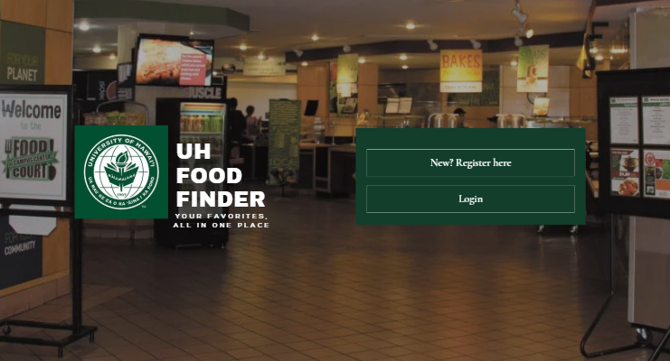
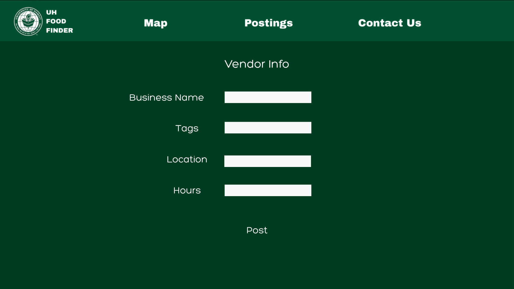

# Project: Manoa Food Finder

## Links
1. GitHub Organization
  https://github.com/manoa-food-finder

2. Team Contract
https://docs.google.com/document/d/1hsP_xAFDBYJTlt6jaIVDKSahPQgqh5Is3safV5Tg37o/edit?tab=t.0

3. M1 Project Page
https://github.com/orgs/manoa-food-finder/projects/2
4. M2 Project Page

## Deployment

## Project Goals
The main objective of the UH Food Finder project is to develop an application that helps students locate food options on the University of Hawaii campus. Our app will allow users to see real-time availability of different menu items, vendor hours and current menus across campus. We aim to solve the problem of not knowing what food is available or where to find it during short breaks on campus. 

## Project Expectations
What we hope to accomplish is to build a website that can help users find places to eat on campus. To achieve this, we want the website to operate for three different groups of people - Users, Vendors, and Admins. Users should be able to navigate the site, and be able to filter out food options that they want and don't want. They should also be able to view all vendors that are currently nearby, and should be able to determine from the posting the Open/Closing hours of the Vendor, what the vendor is serving, and where to find them exactly. Vendors should be able to easily post all of the aformentioned information that a User should expect to find, and they should also be able to edit said information at any time. Finally, Admins should be able to directly control what goes into the site, and should be able to essentially moderate the website in order to shut down any wrongdoing that may occur.

## Mockup Pages

---
